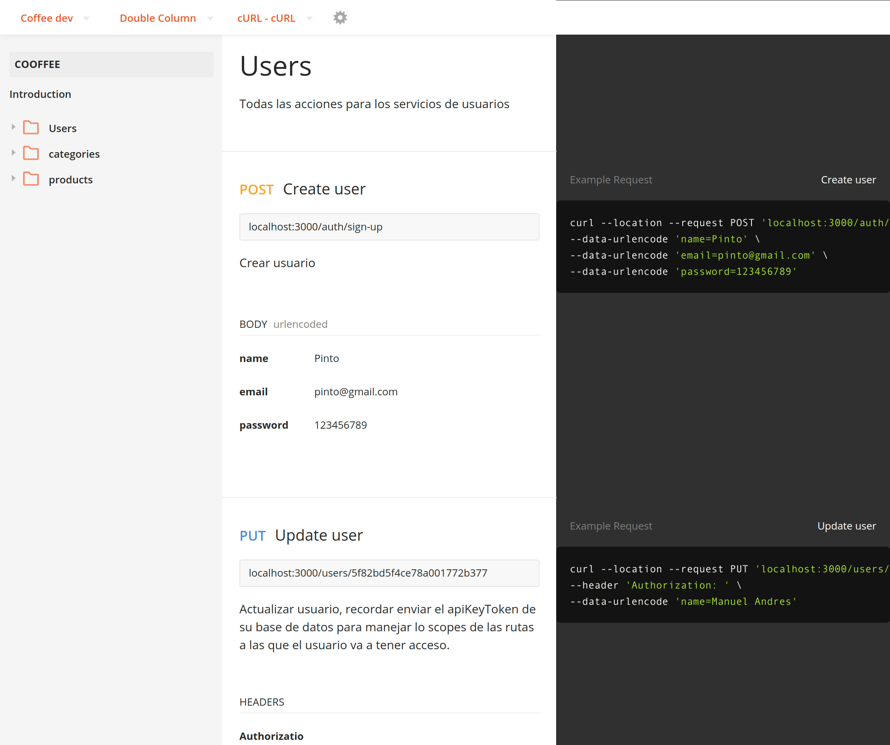

# REST COFFEE

Api para crear categorias y productos, carga de imágenes, autenticación con jw y google api, middleware de scopes y permisos
para la capa de servicios. Esta construida en 3 capas, las rutas o controladores los cuales tienen acceso a la capa 
de servicios o lógica del negocio, y esta a su vez tiene acceso a las librerías, construido con Node y express, como base
de datos se usó MongoDB.

## Empezar 

* `yarn` instalar dependencias.
* `yarn run dev` levantar entorno de desarrollo.
* `yarn start` Levantar en producción.

## Licencia

MIT

## Documentación API

https://documenter.getpostman.com/view/12344823/TVRj6U9v

## URL

https://rest-coffee.herokuapp.com